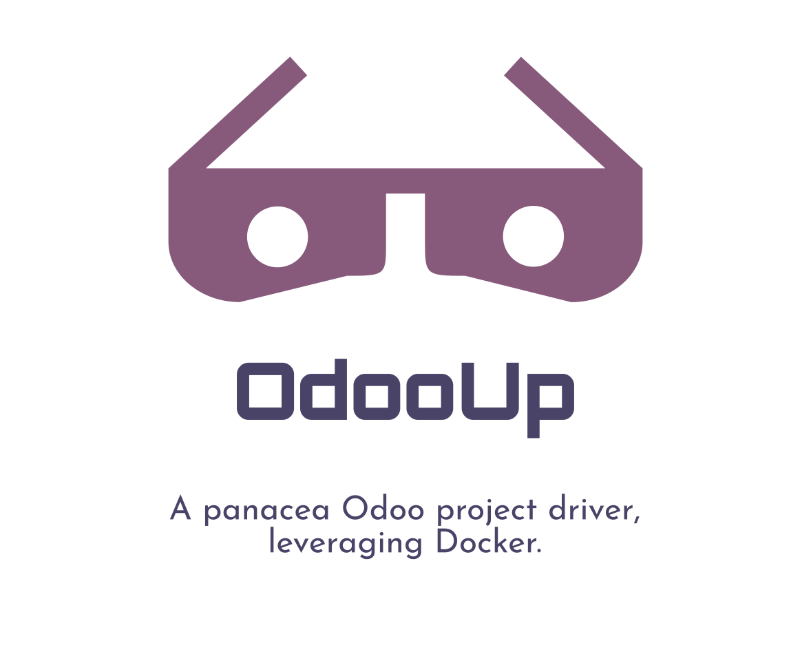

<div align="center">
	<div>
		
	</div>
	<br>
	<br>
	<a href="https://awesome.re">
		
	</a>
	<a href="https://github.com/xoe-labs/odooup/blob/master/LICENSE">
		
	</a>
	<a href="https://pypi.org/project/odooup">
		
	</a>
	<a href="https://matrix.to/#/#odooup:matrix.org">
		
	</a>
	<p>
		<sub>Reference this page with <a href="https://github.com/xoe-labs/odooup#readme"><code>https://github.com/xoe-labs/odooup#readme</code></a>. Check out other <a href="https://github.com/OdooOps/awesome-odoo-ops#readme">awesome Odoo Ops</a> tools.</sub>
	</p>
	<p>
		<sub><a href="https://github.com/xoe-labs/odooup#readme">OdooUp</a> relates to <a href="https://github.com/OCA">OCA</a> in a very friendly way and strives to become OCA's UX optimized and enhanced reference DevOps tooling.</sub>
	</p>
	<br>
</div>

## Quickstart

``` bash
$ pip3 install odooup
$ odooup --help
```

<sub>Before reaching GA, no particular effort will be put on docs except for a clean and easy to read code layout.</sub>

## Components

<sub>Not all components are implemented or operational. Meanwhile, this aims to be a compelling set of tooling to be made available through `odooup`.</sub>

- `odooup` - the CLI entrypoint
- [`odooup init`](https://github.com/xoe-labs/odooup/tree/master/odooup-init#readme) - bootstrap a Odoo project leveraging docker
- [`odooup gen`](https://github.com/xoe-labs/odooup/tree/master/odooup-gen#readme) - bootstrap modules based on bob templates
- [`odooup mask`](https://github.com/xoe-labs/odooup/tree/master/odooup-mask#readme) - use advanced git plumbing to mask modules from your deployable source code
- [`odooup patch`](https://github.com/xoe-labs/odooup/tree/master/odooup-patch#readme) - finally, a wholistic approach to upstream contributing
- [`odooup conform`](https://github.com/xoe-labs/odooup/tree/master/odooup-conform#readme) - conform your code base to `X` (`X` is made available by supported transformers)


## Contribute

- Just follow your instinct & open a PR.
- If you want to pre discuss, join https://matrix.to/#/#odooup:matrix.org.
- Be _somewhat_ familiar with:
    - [`tox`](https://tox.readthedocs.io/en/latest/)
    - [`pre-commit`](https://pre-commit.com/)
- Report issues at [DockeryOdoo](https://github.com/xoe-labs/dockery-odoo/issues>)

## Useful links

  - OdooOps Github Org: https://github.com/OdooOps
  - dockery-odoo: <https://xoe-labs.github.io/dockery-odoo/>
  - dodoo: <https://github.com/xoe-labs/dodoo>

## Credits

Contributors:

  - David Arnold ([XOE](https://xoe.solutions))
  - Deiber Rincón ([XOE](https://xoe.solutions))
  - Yan Chirino ([XOE](https://xoe.solutions))
  - Vladislav Shepilov ([SHEPI](https://github.com/shepilov-vladislav))
  - Ildar Nasyrov ([ITPP](https://www.it-projects.info))


<div align="center">
	<div>
		<a href="https://xoe.solutions">
			
		</a>
	</div>
	<p>
	<sub>Currently, folks <a href="https://github.com/xoe-labs/">@xoe-labs</a> try to keep up with their task to maintain this.</sub>
	</p>
	<p>
	<sub>If you're the kind of person, willing to sponsor open source projects, consider sending some spare XLM banana to <code>blaggacao*keybase.io</code></sub>
	</p>
</div>
